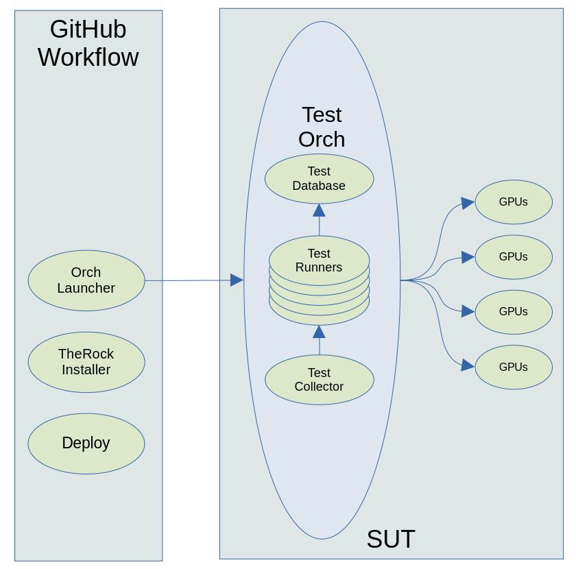

# TheRock Test Harness

______________________________________________________________________

The Rock Test Framework is developed on top of [pytest](https://docs.pytest.org/en/6.2.x/reference.html#) Framework. It can be used to run Rock Tests on AMD GPU enabled BareMetal Machines or KubePods. You can leverage this framework by integrating your tests code via pytest.

## Setup



## Features

- **TestTopology:** Supports all Rock Components testing on all supported AMD GPU Targets running Linux / Windows.
- **Orchestrator:** Auto Detects GPU count and Intellegently fills test shards as per their previous execution history. Thus acheives efficient uses all GPUs for faster execution times.
- **Auto Re-run:** Auto detects the individual test failures and configures to re-run the failed test cases in next iteration.
- **GPU Hang Handling:** Auto detects GPU Hang while test executions.
- **Reporting:** Detailed Reporting in Html format with individual failure tracking against their issue-tickets.

## Cloning Repo and Basic Configuration

```
$ git clone https://github.com/TheRock
$ cd tests/harness
$ pip3 install --quiet -r requirements.txt
```

## Tests Integration using PyTest Framework

#### Test Development

Please add your test function in the following script files to integrate your tests under pytest framework.

- _conftest.py_: Add your tests dependent fixtures in this script file. Ex: _conftest.py::ompEnv()_
- _tests_comp.py_: You can add your actual test functions here. Ex: _tests_comp.py::test_rocprim()_

#### Test Execution

Run the tests using the following options

```
$ cd tests/harness
$ pytest -v -s --tb=short \
    --rock=/TheRock/therock-build  <path to the installed path of the rock> \
    --env VAR:VALUE VAR2:VALUE2  <extra envs that your test needs> \
    tests_*.py -k '<testName|pattern> or <test2Name>'

# Ex: To run rocrand and rocthrust tests
$ pytest -v -s --rock=/TheRock/therock-build tests_*.py -k 'rocrand or rocthrust'

# Ex: To run only hipblas tests but not hipblaslt
$ pytest -v -s --rock=/TheRock/therock-build tests_*.py -k 'hipblas and not hipblaslt'
```

Note: You can get more help on options with `pytest -h`

#### Available Pytest Fixtures in conftest.py

- **therock-path:** The path of TheRock
- **extraEnv:**: The env dictionary provided via `--env` option
- **orch:** The orchestrator to run ctest/gtest/binary type of tests
- **dmesgs:** Fetches node's dmesgs and dumps in dmesg\_<testName>.log
- **report:** Overall Reporting object
- **result:** Test suite result object for Reporting

## Test Sharding with Orchestrator

This is fully developed in pytest framework and basically it works as follows:

- Test Orchestrator detects all the available GPUs on the Pod/Node.
- Installs the required pre-requisites as per the selected tests.
- Collects individual tests of the given test suite.
- Retrives previous execution times of each testcase from cache DB.
- Collects the GPU counts on all the nodes and creates nGPU test runner threads.
- Intellegently fills all the test into the test shards as per the execution times of each tests.
- Queue them in a thread safe Queue data structure.
- Launches the test shards on all the GPU test runners.
- Collects the results from all the Test Runners and creates an Test Reports.

## Utilities

#### Basic Utilities

This includes all the basic utilities that this test harness needs

```
>>> from libs import utils

# Running python functions parallel in threads
>>> def countDown(fromNum):
>>>    import time
>>>      for i in range(fromNum, 0, -1):
>>>         sys.stdout.write(f'{i}\n')
>>>         sys.stdout.flush()
>>>         time.sleep(5)
>>>     return fromNum + 100
>>> rets = utils.runParallel((countDown, (10, )), (countDown, (5, )))
>>> print(f'rets: {rets}')
```

#### Nodelib

Nodelib includes all the node/kubepod accessing functions like run cmd, gpu count, etc,.

```
>>> from libs import nodes

# Creating node object
>>> node = nodes.Node()

# Running shell commands and get the return code
>>> ret = node.runCmd('hostname')
# Running commands and get the return code and console output
>>> ret, out = node.runCmd('rocm-smi', cwd='/opt/rocm/bin/', out=True)
# Running commands with Timeouts
>>> ret = node.runCmd('for ((i=0;i<10;i++)); do echo $i; sleep $i; done', timeout=5)
```

#### Orchestrator

Orchestrator includes helper functions for running tests with ctest/gtest frameworks

```
>>> from libs import orchestrator

# Creating orch object
>>> node = nodes.Node()
>>> orch = orchestrator.Orchestrator(node)

# Running Binary tests
>>> verdict = orch.runBinary('./bin/rocminfo', cwd=rock)
# Running Ctests
>>> verdict = orch.runCtest(cwd=f'{rock}/bin/hipcub')
# Running Gtests
>>> verdict = orch.runGtest('./hipblas-test', env=ompEnv, cwd=f'{rock}/bin')
```

#### Reporting

Reporting includes functions for report purposes, like html reports or console table prints

```
>>> from libs import report

# Creating report object
>>> report = report.Report()

# Add Table to the report
>>> table = report.addTable(title='Test Report:')
>>> table.addHeader('Test', 'Verdict', 'ExecTime')
>>> table.addResult('TestName1', 'PASS', 124)

# Print report to the log console
>>> report.pprint()

# Creating Html Reports
>>> with open('report.html', 'w') as fd:
>>>    fd.write(report.toHtml())
```
